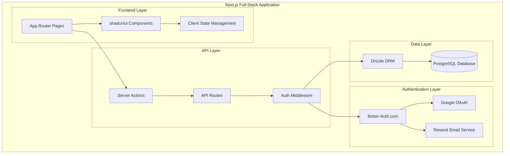

# Design Document

## Overview

This design outlines a comprehensive full-stack Next.js implementation for Pythoughts that migrates from the current Vite + React setup to Next.js with shadcn/ui, implements Drizzle ORM with PostgreSQL, integrates Better-Auth for authentication with Resend for email services. The system maintains the existing terminal-inspired aesthetic while providing enterprise-grade security, performance, and scalability through Next.js's full-stack capabilities.

## Architecture

### High-Level Architecture



### Technology Stack Migration

**Current Stack:**
- Frontend: React 18 + TypeScript + Vite
- Authentication: Supabase Auth
- Database: Supabase PostgreSQL
- UI: Custom components with Tailwind
- Caching: IORedis

**Target Stack:**
- Full-Stack: Next.js 14+ with App Router
- UI Framework: shadcn/ui + Tailwind CSS
- Authentication: Better-Auth.com + Google OAuth + Resend
- Database: PostgreSQL + Drizzle ORM
- Deployment: Vercel/Nixpacks

## Components and Interfaces

### Next.js App Router Structure

#### Authentication System with Better-Auth
```typescript
// lib/auth.ts
import { betterAuth } from "better-auth"
import { drizzleAdapter } from "better-auth/adapters/drizzle"
import { resend } from "better-auth/plugins/resend"

interface AuthConfig {
  database: drizzleAdapter(db);
  emailAndPassword: {
    enabled: true;
    requireEmailVerification: true;
  };
  socialProviders: {
    google: {
      clientId: string;
      clientSecret: string;
    };
  };
  plugins: [
    resend({
      apiKey: string;
      from: string;
    })
  ];
}
```

#### Next.js API Routes Structure
```typescript
// app/api/auth/[...auth]/route.ts
export { GET, POST } from "@/lib/auth"

// app/api/posts/route.ts
interface PostAPI {
  GET: (request: Request) => Promise<Response>;
  POST: (request: Request) => Promise<Response>;
}

// app/api/posts/[id]/route.ts
interface PostDetailAPI {
  GET: (request: Request, { params }: { params: { id: string } }) => Promise<Response>;
  PUT: (request: Request, { params }: { params: { id: string } }) => Promise<Response>;
  DELETE: (request: Request, { params }: { params: { id: string } }) => Promise<Response>;
}
```

#### Server Actions
```typescript
// lib/actions/posts.ts
interface PostActions {
  createPost: (formData: FormData) => Promise<ActionResult>;
  updatePost: (id: string, formData: FormData) => Promise<ActionResult>;
  deletePost: (id: string) => Promise<ActionResult>;
  voteOnPost: (postId: string, voteType: 1 | -1) => Promise<ActionResult>;
}

// lib/actions/auth.ts
interface AuthActions {
  signUp: (formData: FormData) => Promise<ActionResult>;
  signIn: (formData: FormData) => Promise<ActionResult>;
  signOut: () => Promise<ActionResult>;
  verifyEmail: (token: string) => Promise<ActionResult>;
}
```

#### shadcn/ui Components Integration
```typescript
// components/ui/ (shadcn/ui components)
interface ShadcnComponents {
  Button: React.ComponentType<ButtonProps>;
  Input: React.ComponentType<InputProps>;
  Card: React.ComponentType<CardProps>;
  Dialog: React.ComponentType<DialogProps>;
  Form: React.ComponentType<FormProps>;
  Toast: React.ComponentType<ToastProps>;
}

// components/auth/sign-in-form.tsx
interface SignInFormProps {
  onSuccess?: () => void;
  redirectTo?: string;
}

// components/auth/sign-up-form.tsx
interface SignUpFormProps {
  onSuccess?: () => void;
  redirectTo?: string;
}
```

### Database Schema with Drizzle ORM

#### Better-Auth Required Tables
```typescript
// lib/db/schema.ts
import { pgTable, text, timestamp, boolean, uuid, varchar, integer, decimal } from "drizzle-orm/pg-core"

// Better-Auth required tables
export const user = pgTable("user", {
  id: text("id").primaryKey(),
  name: text("name").notNull(),
  email: text("email").notNull().unique(),
  emailVerified: boolean("emailVerified").notNull().default(false),
  image: text("image"),
  createdAt: timestamp("createdAt").notNull(),
  updatedAt: timestamp("updatedAt").notNull(),
});

export const session = pgTable("session", {
  id: text("id").primaryKey(),
  expiresAt: timestamp("expiresAt").notNull(),
  token: text("token").notNull().unique(),
  createdAt: timestamp("createdAt").notNull(),
  updatedAt: timestamp("updatedAt").notNull(),
  ipAddress: text("ipAddress"),
  userAgent: text("userAgent"),
  userId: text("userId").notNull().references(() => user.id),
});

export const account = pgTable("account", {
  id: text("id").primaryKey(),
  accountId: text("accountId").notNull(),
  providerId: text("providerId").notNull(),
  userId: text("userId").notNull().references(() => user.id),
  accessToken: text("accessToken"),
  refreshToken: text("refreshToken"),
  idToken: text("idToken"),
  accessTokenExpiresAt: timestamp("accessTokenExpiresAt"),
  refreshTokenExpiresAt: timestamp("refreshTokenExpiresAt"),
  scope: text("scope"),
  password: text("password"),
  createdAt: timestamp("createdAt").notNull(),
  updatedAt: timestamp("updatedAt").notNull(),
});

export const verification = pgTable("verification", {
  id: text("id").primaryKey(),
  identifier: text("identifier").notNull(),
  value: text("value").notNull(),
  expiresAt: timestamp("expiresAt").notNull(),
  createdAt: timestamp("createdAt"),
  updatedAt: timestamp("updatedAt"),
});

// Application-specific tables
export const posts = pgTable('posts', {
  id: uuid('id').primaryKey().defaultRandom(),
  title: varchar('title', { length: 500 }).notNull(),
  content: text('content').notNull(),
  authorId: text('author_id').references(() => user.id).notNull(),
  postType: varchar('post_type', { length: 20 }).notNull(),
  imageUrl: text('image_url'),
  category: varchar('category', { length: 100 }),
  isPublished: boolean('is_published').default(true),
  voteCount: integer('vote_count').default(0),
  commentCount: integer('comment_count').default(0),
  trendingScore: decimal('trending_score', { precision: 10, scale: 2 }).default('0'),
  createdAt: timestamp('created_at').defaultNow(),
  updatedAt: timestamp('updated_at').defaultNow(),
});

export const comments = pgTable('comments', {
  id: uuid('id').primaryKey().defaultRandom(),
  content: text('content').notNull(),
  authorId: text('author_id').references(() => user.id).notNull(),
  postId: uuid('post_id').references(() => posts.id).notNull(),
  parentCommentId: uuid('parent_comment_id').references(() => comments.id),
  depth: integer('depth').default(0),
  voteCount: integer('vote_count').default(0),
  isDeleted: boolean('is_deleted').default(false),
  createdAt: timestamp('created_at').defaultNow(),
  updatedAt: timestamp('updated_at').defaultNow(),
});

export const votes = pgTable('votes', {
  id: uuid('id').primaryKey().defaultRandom(),
  userId: text('user_id').references(() => user.id).notNull(),
  postId: uuid('post_id').references(() => posts.id),
  commentId: uuid('comment_id').references(() => comments.id),
  voteType: integer('vote_type').notNull(), // 1 for upvote, -1 for downvote
  createdAt: timestamp('created_at').defaultNow(),
});

export const tasks = pgTable('tasks', {
  id: uuid('id').primaryKey().defaultRandom(),
  title: varchar('title', { length: 500 }).notNull(),
  description: text('description'),
  status: varchar('status', { length: 20 }).notNull().default('todo'),
  priority: varchar('priority', { length: 20 }).notNull().default('medium'),
  dueDate: timestamp('due_date'),
  assigneeId: text('assignee_id').references(() => user.id),
  creatorId: text('creator_id').references(() => user.id).notNull(),
  completedAt: timestamp('completed_at'),
  createdAt: timestamp('created_at').defaultNow(),
  updatedAt: timestamp('updated_at').defaultNow(),
});
```

### Trending Algorithm

#### Trending Score Calculation
```typescript
// lib/services/trending.ts
interface TrendingMetrics {
  voteScore: number;
  commentScore: number;
  recencyScore: number;
  engagementScore: number;
  finalScore: number;
}

interface TrendingAlgorithm {
  calculateTrendingScore: (post: Post, metrics: PostMetrics) => number;
  updateTrendingScores: () => Promise<void>;
  getTrendingPosts: (limit: number, timeframe: string) => Promise<Post[]>;
}

// Algorithm Formula:
// TrendingScore = (VoteWeight * VoteScore) + 
//                 (CommentWeight * CommentScore) + 
//                 (RecencyWeight * RecencyScore) + 
//                 (EngagementWeight * EngagementScore)

// lib/actions/trending.ts
export async function updateTrendingScores() {
  "use server"
  // Server action to update trending scores
}

export async function getTrendingPosts(timeframe: string = '24h') {
  "use server"
  // Server action to get trending posts
}
```

### Next.js App Structure

#### Page Routes
```typescript
// app/layout.tsx - Root layout with providers
interface RootLayoutProps {
  children: React.ReactNode;
}

// app/page.tsx - Home page (newsfeed)
// app/blogs/page.tsx - Blog listing page
// app/blogs/[id]/page.tsx - Individual blog post
// app/tasks/page.tsx - Task management page
// app/profile/page.tsx - User profile page
// app/auth/signin/page.tsx - Sign in page
// app/auth/signup/page.tsx - Sign up page
// app/auth/verify-email/page.tsx - Email verification page
```

#### Client Components with shadcn/ui
```typescript
// components/auth/auth-provider.tsx
"use client"
interface AuthProviderProps {
  children: React.ReactNode;
}

// components/posts/post-list.tsx
"use client"
interface PostListProps {
  initialPosts: Post[];
  postType: 'news' | 'blog';
}

// components/tasks/task-board.tsx
"use client"
interface TaskBoardProps {
  initialTasks: Task[];
}
```

#### Server Components for Data Fetching
```typescript
// app/page.tsx (Server Component)
interface HomePageProps {
  searchParams: { [key: string]: string | string[] | undefined };
}

// lib/data/posts.ts
interface PostQueries {
  getPosts: (type?: 'news' | 'blog', limit?: number) => Promise<Post[]>;
  getPostById: (id: string) => Promise<Post | null>;
  getTrendingPosts: (timeframe?: string) => Promise<Post[]>;
}

// lib/data/tasks.ts
interface TaskQueries {
  getTasks: (userId: string, status?: TaskStatus) => Promise<Task[]>;
  getTaskById: (id: string) => Promise<Task | null>;
}
```

## Data Models

### User Management
```typescript
interface User {
  id: string;
  email: string;
  name: string;
  username?: string;
  avatar_url?: string;
  bio?: string;
  emailVerified: boolean;
  createdAt: Date;
  updatedAt: Date;
}

interface UserProfile extends User {
  postsCount: number;
  followersCount: number;
  followingCount: number;
  tasksCount: number;
  reputation: number;
}
```

### Content Models
```typescript
interface Post {
  id: string;
  title: string;
  content: string;
  authorId: string;
  postType: 'news' | 'blog';
  imageUrl?: string;
  category?: string;
  isPublished: boolean;
  voteCount: number;
  commentCount: number;
  trendingScore: number;
  tags: string[];
  createdAt: Date;
  updatedAt: Date;
  author?: User;
}

interface Comment {
  id: string;
  content: string;
  authorId: string;
  postId: string;
  parentCommentId?: string;
  depth: number;
  voteCount: number;
  isDeleted: boolean;
  createdAt: Date;
  updatedAt: Date;
  author?: User;
  replies?: Comment[];
}
```

### Task Management
```typescript
interface Task {
  id: string;
  title: string;
  description: string;
  status: 'todo' | 'in_progress' | 'completed' | 'archived';
  priority: 'low' | 'medium' | 'high' | 'urgent';
  dueDate?: Date;
  assigneeId?: string;
  creatorId: string;
  tags: string[];
  completedAt?: Date;
  createdAt: Date;
  updatedAt: Date;
  assignee?: User;
  creator?: User;
}
```

## Error Handling

### API Error Response Format
```typescript
interface APIError {
  success: false;
  error: {
    code: string;
    message: string;
    details?: any;
    timestamp: string;
    path: string;
  };
}

interface ValidationError {
  field: string;
  message: string;
  code: string;
}
```

### Error Handling Middleware
```typescript
// server/middleware/errorHandler.ts
interface ErrorHandler {
  handleValidationError: (error: ValidationError) => APIError;
  handleAuthError: (error: AuthError) => APIError;
  handleDatabaseError: (error: DatabaseError) => APIError;
  handleGenericError: (error: Error) => APIError;
}
```

### Frontend Error Handling
```typescript
// utils/errorHandler.ts
interface ErrorHandling {
  displayError: (error: APIError) => void;
  logError: (error: Error, context: string) => void;
  retryOperation: <T>(operation: () => Promise<T>, maxRetries: number) => Promise<T>;
}
```

## Testing Strategy

### Next.js Testing Strategy
```typescript
// __tests__/api/auth.test.ts
interface AuthAPITests {
  testUserRegistration: () => Promise<void>;
  testEmailVerification: () => Promise<void>;
  testPasswordReset: () => Promise<void>;
  testGoogleOAuth: () => Promise<void>;
  testSessionManagement: () => Promise<void>;
}

// __tests__/lib/actions/posts.test.ts
interface PostActionTests {
  testCreatePost: () => Promise<void>;
  testUpdatePost: () => Promise<void>;
  testDeletePost: () => Promise<void>;
  testVoteOnPost: () => Promise<void>;
}

// __tests__/components/auth/sign-in-form.test.tsx
interface AuthComponentTests {
  testSignInFlow: () => Promise<void>;
  testSignUpFlow: () => Promise<void>;
  testFormValidation: () => Promise<void>;
  testErrorHandling: () => Promise<void>;
}

// __tests__/e2e/auth.spec.ts (Playwright)
interface E2EAuthTests {
  testCompleteAuthFlow: () => Promise<void>;
  testSocialLogin: () => Promise<void>;
  testPasswordRecovery: () => Promise<void>;
  testEmailVerification: () => Promise<void>;
}
```

### Performance Testing
```typescript
interface PerformanceTests {
  testAPIResponseTimes: () => Promise<void>;
  testDatabaseQueryPerformance: () => Promise<void>;
  testCacheEffectiveness: () => Promise<void>;
  testConcurrentUserLoad: () => Promise<void>;
}
```

## Security Considerations

### Authentication Security
- JWT token rotation and secure storage
- Rate limiting on authentication endpoints
- CSRF protection for state-changing operations
- Secure session management with httpOnly cookies
- Email verification for account security

### API Security
- Input validation and sanitization
- SQL injection prevention through Drizzle ORM
- XSS protection with content sanitization
- CORS configuration for allowed origins
- Request size limits and timeout handling

### Data Protection
- Encryption of sensitive data at rest
- Secure password hashing with bcrypt
- PII data handling compliance
- Audit logging for sensitive operations
- Regular security dependency updates

## Performance Optimization

### Next.js Built-in Optimizations
```typescript
// next.config.js
interface NextConfig {
  experimental: {
    serverComponentsExternalPackages: ['@node-rs/argon2'];
  };
  images: {
    domains: ['example.com'];
    formats: ['image/webp', 'image/avif'];
  };
}
```

### Caching Strategy
```typescript
// lib/cache.ts
interface CacheStrategy {
  // Next.js built-in caching
  revalidate: {
    posts: 300; // 5 minutes
    trending: 60; // 1 minute
    userProfile: 1800; // 30 minutes
  };
  
  // Custom caching with unstable_cache
  getTrendingPosts: () => Promise<Post[]>;
  getUserProfile: (userId: string) => Promise<User>;
}

// Using Next.js caching
export const getTrendingPosts = unstable_cache(
  async () => {
    // Database query
  },
  ['trending-posts'],
  { revalidate: 300 }
);
```

### Database Optimization
- Drizzle ORM with connection pooling
- Query optimization with proper indexing
- Pagination with cursor-based navigation
- Prepared statements for performance
- Database query monitoring and logging

### Frontend Optimization
- Next.js App Router with automatic code splitting
- Server Components for initial page loads
- Streaming with Suspense boundaries
- Image optimization with next/image
- Font optimization with next/font
- Static generation where possible